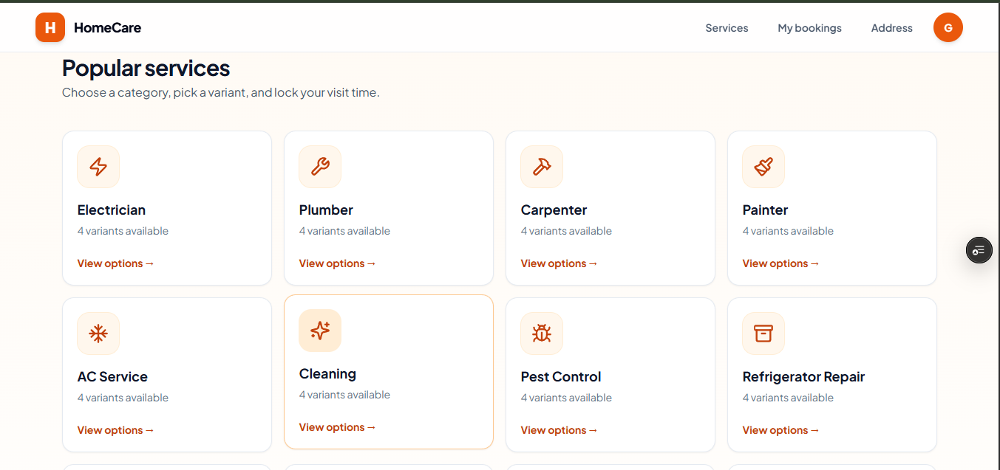
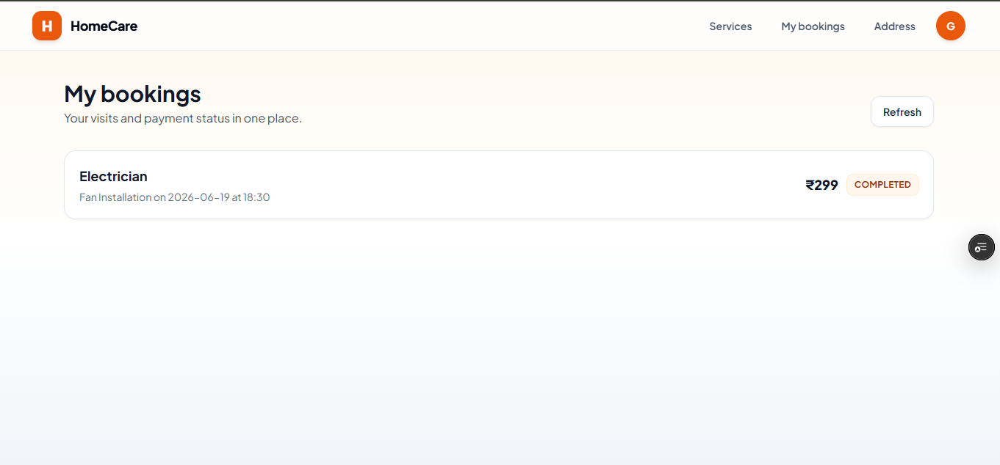
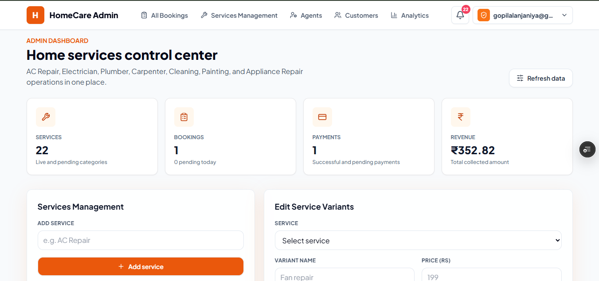

HomeCare - Home Service Booking Platform
📌 Overview

HomeCare is a full-stack web application that connects customers with trusted service professionals for various home maintenance and repair needs. The platform allows users to explore services, book appointments, manage bookings, and receive reliable home services from skilled technicians.

🚀 Features

--> User Features
User Registration and Login
Browse Available Services
Book Home Services Online
View Booking History
Manage User Profile
Responsive Design for Mobile and Desktop

-->Service Categories
🛠️ Furniture Repair
❄️ AC Repair & Maintenance
💨 Fan Repair
⚡ Electrical Services
🚰 Plumbing Services
🧹 Home Cleaning
🎨 Painting Services
🔧 Appliance Repair
👷 Carpenter Services
🏠 General Home Maintenance

--> Admin Features
Manage Users
Manage Services
View and Manage Bookings
Update Service Status
Dashboard for Monitoring Activities

--> 🛠️ Tech Stack
Frontend
React.js
HTML5
CSS3
JavaScript
Bootstrap / Tailwind CSS

Backend
Node.js
Express.js

Database
MongoDB

Authentication
JWT (JSON Web Token)
bcrypt.js

--> 📂 Project Structure
HomeCare/
│
├── client/
│   ├── src/
│   ├── public/
│
├── server/
│   ├── controllers/
│   ├── routes/
│   ├── models/
│   ├── middleware/
│
├── database/
│
├── package.json
└── README.md

--> ⚙️ Installation
Clone Repository
git clone https://github.com/your-username/homecare.git

Navigate to Project
cd homecare

Install Dependencies
Frontend
cd client
npm install
Backend
cd server
npm install

Configure Environment Variables

Create a .env file inside the server directory.

PORT=5000
MONGO_URI=your_mongodb_connection_string
JWT_SECRET=your_secret_key
Start Backend Server
npm start
Start Frontend
npm start

📸 Screenshots

 Admin

 
--> 🎯 Future Enhancements
Online Payment Integration
Real-Time Service Tracking
Service Provider Dashboard
Ratings and Reviews
Push Notifications
Email Notifications
Multi-Language Support

-->🤝 Contributing

Contributions are welcome. Feel free to fork the repository and submit pull requests.

 👨‍💻 Author

Gopilal Anjaniya

MERN Stack Developer
